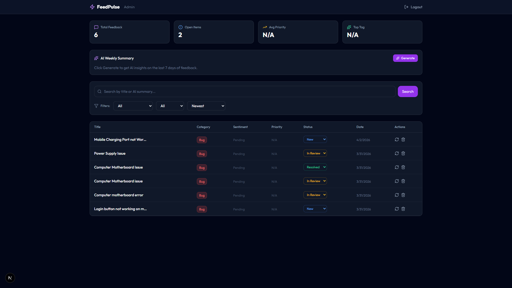
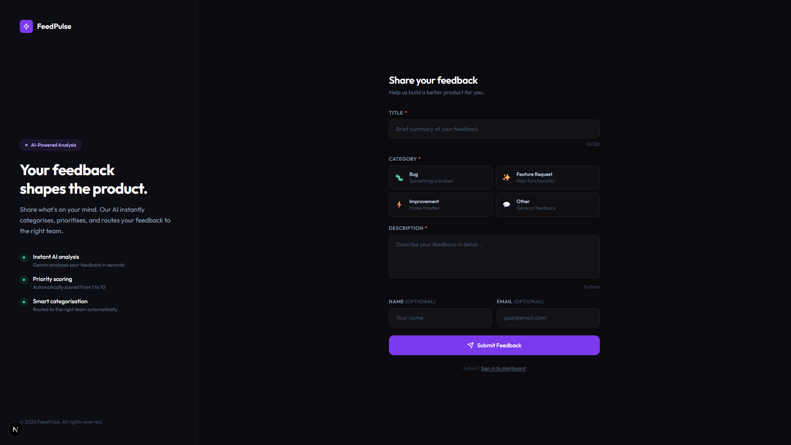
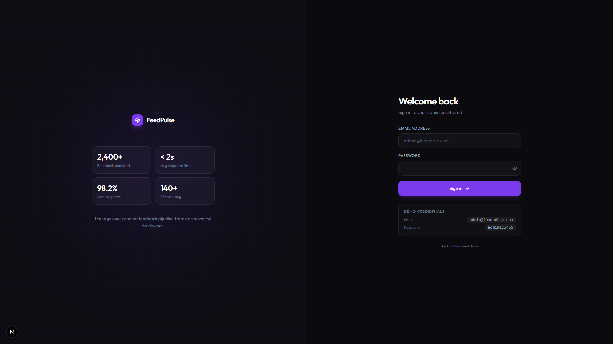

# FeedPulse - AI-Powered Product Feedback Platform

FeedPulse is a full-stack internal tool that lets teams collect product feedback and feature requests, then uses Google Gemini AI to automatically categorise, prioritise, and summarise them — giving product teams instant clarity on what to build next.



## Tech Stack

| Layer | Technology |
|-------|-----------|
| Frontend | Next.js 14, TypeScript, Tailwind CSS |
| Backend | Node.js, Express, TypeScript |
| Database | MongoDB, Mongoose |
| AI | Google Gemini API |
| Auth | JWT (JSON Web Tokens) |

## Features

- Public feedback submission form with client-side validation
- AI-powered automatic categorisation, sentiment analysis, and priority scoring
- Protected admin dashboard with JWT authentication
- Filter, search, sort, and paginate feedback
- Update feedback status (New → In Review → Resolved)
- AI weekly summary of top themes
- Re-trigger AI analysis on any feedback item
- Rate limiting (5 submissions per IP per hour)

## Project Structure
```
feedpulse/
├── frontend/          ← Next.js 14 app
│   ├── app/
│   │   ├── page.tsx           (Feedback submission form)
│   │   ├── admin/page.tsx     (Admin login)
│   │   └── dashboard/page.tsx (Admin dashboard)
│   └── lib/
│       └── api.ts             (Axios API service)
│
├── backend/           ← Node.js + Express API
│   └── src/
│       ├── config/db.ts
│       ├── controllers/
│       ├── middleware/
│       ├── models/
│       ├── routes/
│       └── services/gemini.service.ts
│
└── README.md
```

## Getting Started

### Prerequisites

- Node.js v18+
- MongoDB Atlas account (free tier)
- Google AI Studio account (free Gemini API key)

### 1. Clone the repository
```bash
git clone https://github.com/thepraveen21/FeedPulse-AI-Feedback-Platform
cd feedpulse
```

### 2. Setup the Backend
```bash
cd backend
npm install
```

Create a `.env` file inside the `backend/` folder:
```env
PORT=4000
MONGODB_URI=your_mongodb_connection_string/feedpulse?retryWrites=true&w=majority
GEMINI_API_KEY=your_gemini_api_key
JWT_SECRET=feedpulse_super_secret_jwt_key_2024
ADMIN_EMAIL=admin@feedpulse.com
ADMIN_PASSWORD=admin123456
```

Start the backend:
```bash
npm run dev
```

Backend runs on [http://localhost:4000](http://localhost:4000)

### 3. Setup the Frontend
```bash
cd frontend
npm install
```

Create a `.env.local` file inside the `frontend/` folder:
```env
NEXT_PUBLIC_API_URL=http://localhost:4000/api
```

Start the frontend:
```bash
npm run dev
```

Frontend runs on [http://localhost:3000](http://localhost:3000)

### 4. Admin Login

Navigate to [http://localhost:3000/admin](http://localhost:3000/admin)
```
Email:    admin@feedpulse.com
Password: admin123456
```

## API Endpoints

| Method | Endpoint | Description | Auth |
|--------|----------|-------------|------|
| POST | /api/auth/login | Admin login | Public |
| POST | /api/feedback | Submit feedback | Public |
| GET | /api/feedback | Get all feedback | Admin |
| GET | /api/feedback/:id | Get single feedback | Admin |
| PATCH | /api/feedback/:id | Update status | Admin |
| DELETE | /api/feedback/:id | Delete feedback | Admin |
| GET | /api/feedback/summary | AI weekly summary | Admin |
| POST | /api/feedback/:id/reanalyze | Re-trigger AI | Admin |

## Environment Variables

### Backend (`backend/.env`)

| Variable | Description |
|----------|-------------|
| PORT | Server port (default: 4000) |
| MONGODB_URI | MongoDB Atlas connection string |
| GEMINI_API_KEY | Google Gemini API key |
| JWT_SECRET | Secret key for JWT signing |
| ADMIN_EMAIL | Admin login email |
| ADMIN_PASSWORD | Admin login password |

### Frontend (`frontend/.env.local`)

| Variable | Description |
|----------|-------------|
| NEXT_PUBLIC_API_URL | Backend API base URL |

## Screenshots

### Feedback Submission Form


### Admin Login


### Admin Dashboard


